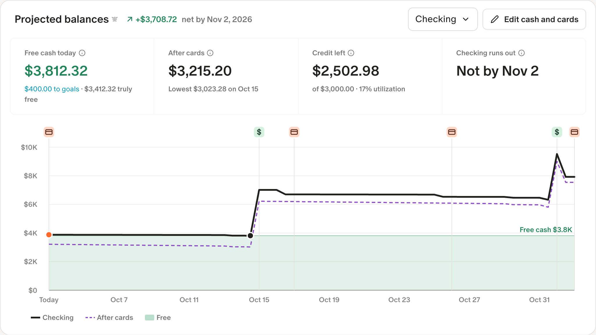

<div align="center">

<picture>
  <source media="(prefers-color-scheme: dark)" srcset="assets/wordmark-dark.svg">
  
</picture>

### More features for your money in Monarch.

Extended features inside the Monarch Money[^monarch] web app.

[Website](https://wingspan.axerie.com) · [Quick start](https://wingspan.axerie.com/quick-start/) · [Features](https://wingspan.axerie.com/features/) · [Roadmap](https://wingspan.axerie.com/roadmap/) · [Privacy](https://wingspan.axerie.com/privacy/)

[](https://github.com/axerieSoftware/wingspan/actions/workflows/ci.yml) [](LICENSE)  

<br>

<picture>
  <source media="(prefers-color-scheme: dark)" srcset="assets/screenshots/projected-balances-dark.png">
  
</picture>

<sub>Projected balances on Monarch's Cash Flow page</sub>

</div>

## Why Wingspan

Wingspan adds features Monarch Money doesn't have yet, plus a few I wanted for my own money. Each one shows up on the Monarch page it belongs on, looks like Monarch, and carries a small Wingspan mark  so you can tell it apart from Monarch's own. When Monarch ships its own version of a feature, Wingspan's version is deprecated and removed.

## Features

Card payments and bills in Recurring, due dates, projected balances and free cash on Cash Flow, retail receipt syncing, and more. See the [feature guide](https://wingspan.axerie.com/features/).

## Install

Wingspan is in beta and not in the browser stores yet. Each [release](https://github.com/axerieSoftware/wingspan/releases) has a zip per browser. Unzip it, then:

- **Chrome or Edge 144+:** open `chrome://extensions` or `edge://extensions`, turn on **Developer mode**, click **Load unpacked** and choose the unzipped folder.
- **Firefox 141+ (experimental):** open `about:debugging#/runtime/this-firefox`, click **Load Temporary Add-on…** and choose `manifest.json` in the unzipped folder. Firefox removes it when it restarts, since the build isn't signed. If Wingspan doesn't appear on Monarch, open **Extensions** in the toolbar and allow it on app.monarch.com.
- **Safari 26+ (experimental, untested):** turn on Safari's developer features, then in **Settings → Developer** click **Add Temporary Extension…** and choose the unzipped folder.

Or build it from source (using Edge as an example):

```bash
git clone https://github.com/AxerieSoftware/wingspan.git
cd wingspan
npm install
npm run build:edge
```

and load `.output/edge-mv3` as above. `npm run build:chrome`, `build:firefox` and `build:safari` build the others into `.output/chrome-mv3`, `firefox-mv3` and `safari-mv3` respectively.

Wingspan adds to Monarch's newer Recurring page, so turn on **Recurring 2.0** in Monarch under **Settings → Early Access**. The [quick start](https://wingspan.axerie.com/quick-start/) walks through adding your first card payment.

## Your data

- **No extra server.** No analytics, no tracking, no backend. Wingspan talks to Monarch, using the session you're already signed into, and to a retailer's site only when you sync receipts from it.
- **Few permissions.** It runs only on `app.monarch.com`, with `storage` and `scripting`. Access to a retailer's site is requested only the first time you sync receipts from it.
- **Saves in your Monarch account.** Data is stored in a hidden manual account named "wingspan", so everyone in the household sees the same data in any browser.
- **Easy to audit.** Every request it sends to Monarch has `client=wingspan` in its URL. Filter DevTools → Network by `client=wingspan` to see all of them.

See the [privacy policy](https://wingspan.axerie.com/privacy/) and [how it works](https://wingspan.axerie.com/how-it-works/).

## Contributing

Bugs and ideas go in [Issues](https://github.com/axerieSoftware/wingspan/issues/new/choose). To build, test or find your way around the code, see [CONTRIBUTING.md](CONTRIBUTING.md). Security reports go through [SECURITY.md](SECURITY.md).

## License

[MIT](LICENSE) © Axerie Software

[^monarch]: Wingspan isn't affiliated with or endorsed by Monarch Money. Monarch's web API isn't public and can change without notice, so parts of Wingspan may stop working until they're updated.
